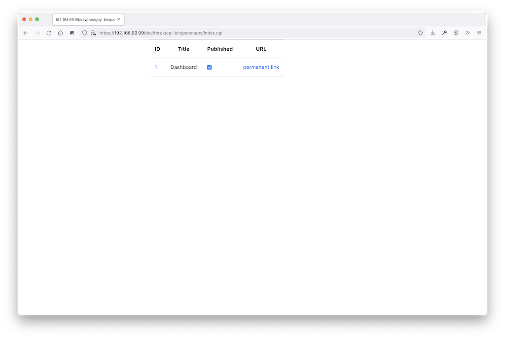

# pansnaps



```
$ git clone ... $OMD_ROOT/etc/thruk/plugins-available/pansnaps
$ ln -s ../plugins-available/pansnaps $OMD_ROOT/etc/thruk/plugins-enabled/pansnaps
$ cd $OMD_ROOT/etc/thruk/plugins-enabled/pansnaps
$ cp pansnaps.conf $OMD_ROOT/etc/apache/conf.d
$ cp pansnaps.crontab $OMD_ROOT/etc/cron.d/pansnaps
$ mkdir -p $OMD_ROOT/var/pansnaps/htdocs
$ omd reload apache
$ omd reload crontab
```

ImageMagick needs permission to use label:

```
OMD[pansnaps@centos7-64]:~$ grep -i label /etc/ImageMagick/policy.xml 
<!-- <policy domain="coder" rights="none" pattern="LABEL" /> -->
```

